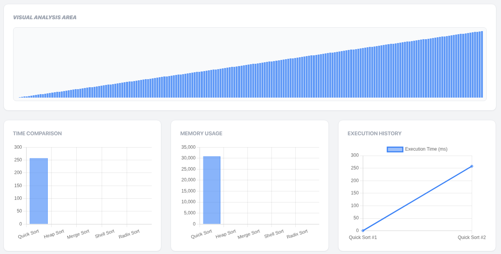
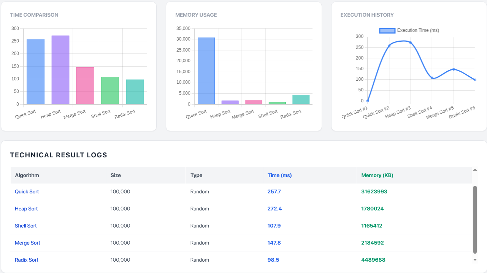

# 🚀 Sorting Algorithm Performance Analyzer


A comprehensive web-based tool developed to analyze, visualize, and compare the performance of 5 fundamental sorting algorithms. This project was built as part of the **Algorithms Course Term Project** to demonstrate the practical differences between theoretical Big-O complexity and real-world execution metrics.

## 📸 Screenshots


_Figure 1: Main Dashboard showing real-time visualization and performance controls._


_Figure 2: Comparative analysis of Quick Sort vs. Heap Sort on Reverse Ordered Data._

## 🎯 Project Objective

The main goal of this project is to evaluate the efficiency of sorting algorithms based on:

1.  **Time Complexity:** Measuring execution time in milliseconds (ms).
2.  **Space Complexity:** Analyzing additional memory usage in Kilobytes (KB).
3.  **Stability:** Observing behavior under different dataset characteristics (Random, Reverse, Partially Sorted).

## ⚡ Features

- **Multi-Algorithm Support:** Quick Sort, Heap Sort, Merge Sort, Shell Sort, and Radix Sort.
- **Dynamic Data Generation:**
  - Randomly Ordered
  - Reverse Ordered (Worst-Case simulation)
  - Partially Sorted (Real-world simulation)
- **Variable Data Sizes:** Supports testing from small (1,000) to large (100,000) datasets.
- **Real-Time Visualization:**
  - Visual sorting animation for small datasets using a sampling strategy.
  - Interactive bar charts for algorithm comparison.
  - Line charts tracking execution history.
- **Modular Architecture:** Built with a custom `useSorting` hook and component-based structure.
- **Advanced Metrics:** Uses `performance.now()` for high-precision timing and `performance.memory` for heap usage analysis.

## 🛠️ Technology Stack

- **Frontend:** React.js (Vite)
- **Styling:** Tailwind CSS
- **Visualization:** Chart.js (`react-chartjs-2`)
- **Logic:** Modern JavaScript (ES6+) with Async/Await for animations.

## 📂 Project Structure

The project follows a clean, modular architecture:

```bash
src/
├── algorithms/       # Pure JS implementations of sorting algorithms
│   ├── quickSort.js
│   ├── mergeSort.js
│   ├── heapSort.js
│   ├── shellSort.js
│   └── radixSort.js
├── components/       # UI Components
│   ├── ControlPanel.jsx
│   ├── Visualizer.jsx
│   ├── PerformanceCharts.jsx
│   └── StatsTable.jsx
├── hooks/            # Custom Hooks
│   └── useSorting.js # Core logic and state management
├── utils/            # Helper functions
│   ├── dataGenerator.js
│   └── performanceTracker.js
└── App.jsx           # Main entry point
```
